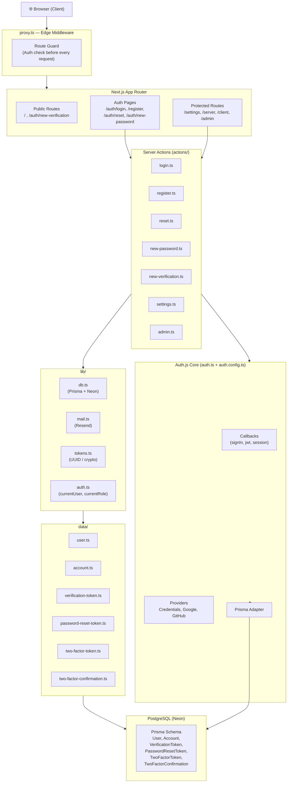
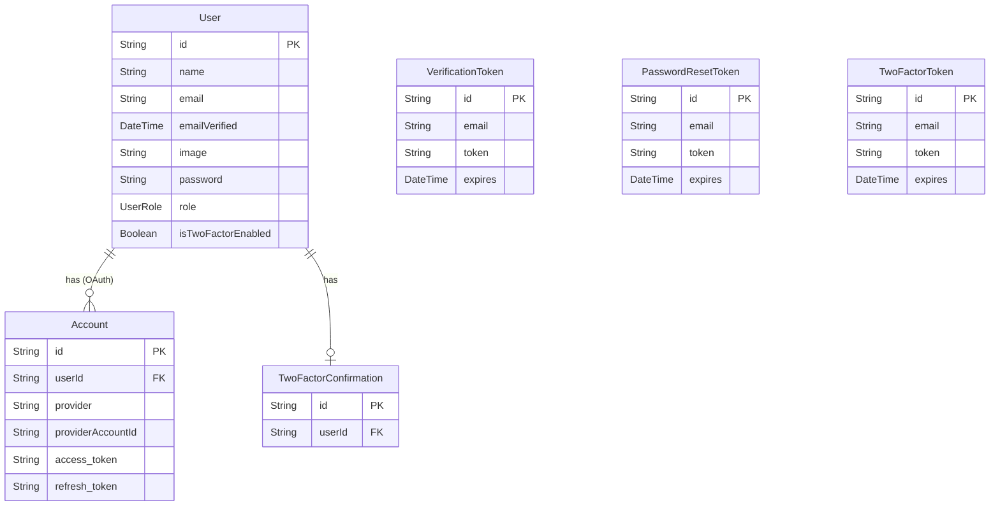
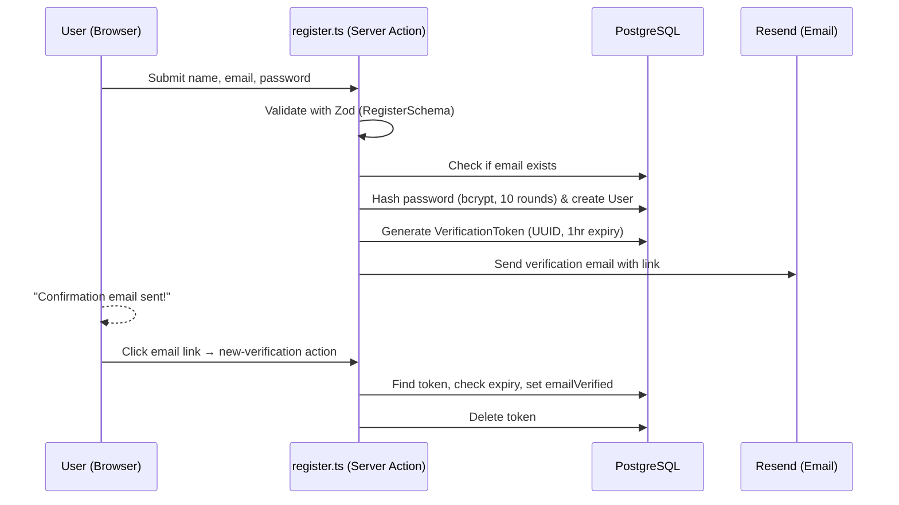
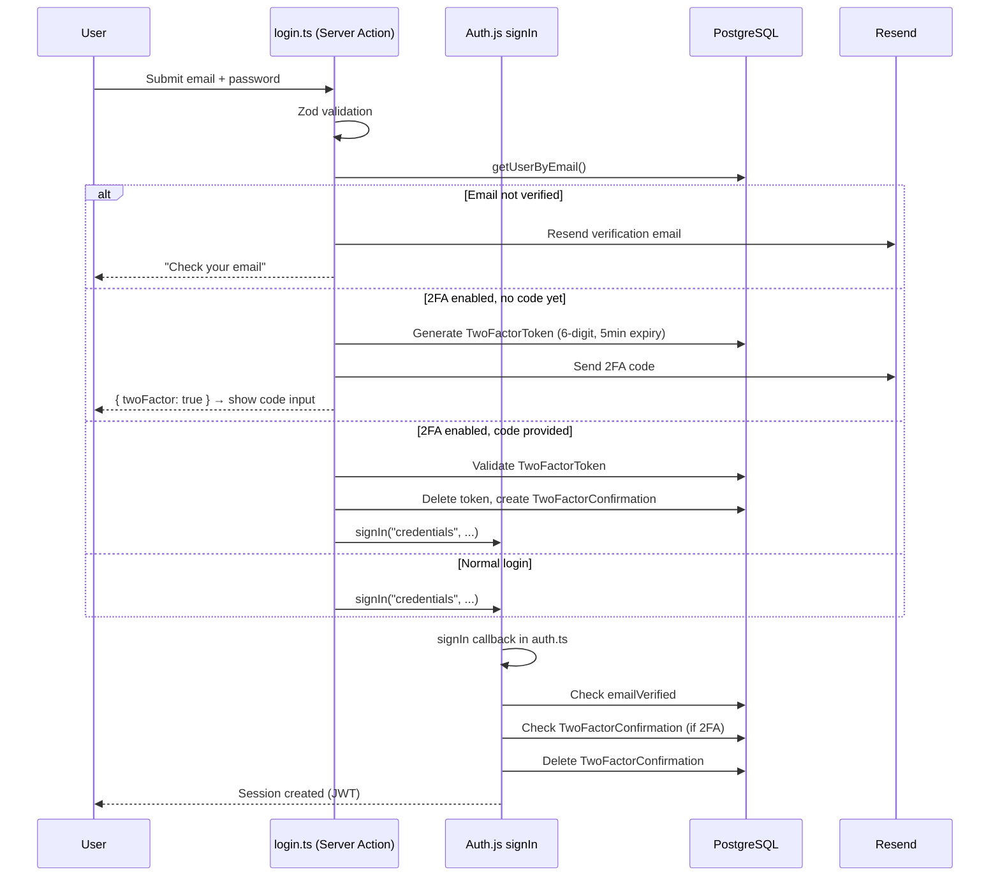
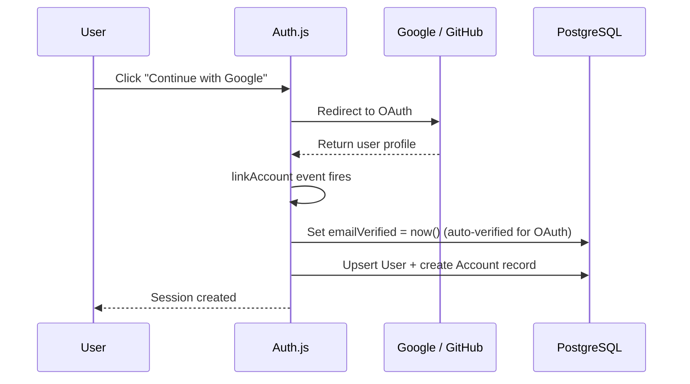
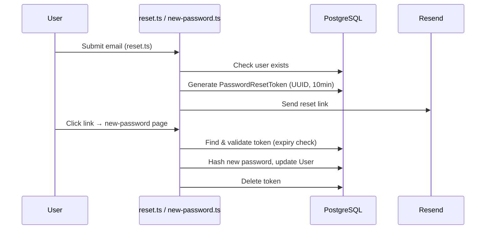

# 🔐 AuthForge — Project Architecture

> *"Let me walk you through the architecture of this project as if I were presenting it in an interview."*

---

## 1. What Is This Project?

**AuthForge** is a full-featured authentication system built with **Next.js 16 (App Router)** and **Auth.js v5 (NextAuth beta)**. The goal was to build a production-ready auth layer that handles every real-world scenario: credential login, OAuth via Google and GitHub, email verification, password reset, two-factor authentication (2FA), and role-based authorization — all in a single, clean codebase.

---

## 2. Tech Stack

| Layer | Technology |
|---|---|
| **Framework** | Next.js 16 (App Router) |
| **Authentication** | Auth.js v5 (next-auth beta) |
| **Database** | PostgreSQL (Neon serverless) |
| **ORM** | Prisma 7 with `@prisma/adapter-neon` |
| **Email** | Resend API |
| **Validation** | Zod |
| **Forms** | React Hook Form + Zod Resolver |
| **UI** | shadcn/ui (Radix UI primitives) + Tailwind CSS v4 |
| **Language** | TypeScript |

> [!NOTE]
> The database connection uses **Neon's serverless PostgreSQL driver** via WebSockets, which is ideal for edge/serverless deployment. In development it falls back to the `ws` package; in production, Neon's native WebSocket transport takes over automatically.

---

## 3. High-Level Architecture



---

## 4. Folder Structure Explained

```
auth-v1/
├── app/                        # Next.js App Router pages
│   ├── (protected)/            # Route group — all require auth (enforced by middleware)
│   │   ├── settings/           # User settings page (name, role, 2FA toggle)
│   │   ├── server/             # Demo: Server Component session access
│   │   ├── client/             # Demo: Client Component session access
│   │   └── admin/              # Role-gated admin panel
│   ├── auth/                   # Public auth pages
│   │   ├── login/
│   │   ├── register/
│   │   ├── reset/              # Password reset request
│   │   ├── new-password/       # Set new password (via token)
│   │   ├── new-verification/   # Email verification callback
│   │   └── error/              # Auth error page
│   ├── api/
│   │   ├── auth/[...nextauth]/ # Auth.js catch-all API handler
│   │   └── admin/              # Admin-only REST endpoint (demo)
│   └── page.tsx                # Landing page
│
├── actions/                    # Next.js Server Actions (no API routes for forms!)
│   ├── login.ts
│   ├── register.ts
│   ├── reset.ts
│   ├── new-password.ts
│   ├── new-verification.ts
│   ├── settings.ts
│   └── admin.ts
│
├── auth.ts                     # Auth.js config: callbacks, adapter, session strategy
├── auth.config.ts              # Auth.js providers (split for Edge compatibility)
├── proxy.ts                    # Next.js Middleware (renamed from middleware.ts)
├── routes.ts                   # Central route classification
│
├── components/
│   ├── auth/                   # 14 auth-specific UI components
│   └── ui/                     # shadcn/ui primitives
│
├── data/                       # Database query helpers (thin repository layer)
├── lib/                        # Core utilities (db, mail, tokens, auth helpers)
├── hooks/                      # Client-side hooks (useCurrentUser, useCurrentRole)
├── schemas/                    # Zod validation schemas
└── prisma/
    └── schema.prisma           # Database models
```

---

## 5. Database Design



**Key Design Decisions:**
- `User.password` is nullable — OAuth users don't have one, which is how we distinguish credential vs. OAuth accounts.
- `TwoFactorConfirmation` acts as a one-time "pass" created after a valid 2FA code and consumed inside the `signIn` callback — it's deleted on every successful login.
- Tokens (verification, password reset, 2FA) are stored separately from the user, with expiry timestamps and unique constraints on `[email, token]`.

---

## 6. Authentication Flows

### 6a. Credential Registration + Email Verification



### 6b. Credential Login (with optional 2FA)



### 6c. OAuth Login (Google / GitHub)



> [!IMPORTANT]
> OAuth users **bypass email verification** by design — their email is already verified by the provider. The `linkAccount` event in `auth.ts` sets `emailVerified` automatically.

### 6d. Password Reset Flow



---

## 7. Middleware — The Route Guard

The file [`proxy.ts`](file:///d:/anmol/auth-v1/proxy.ts) (exported as `default` and `config` — Next.js picks it up as middleware) runs on **every request at the Edge** before the page is rendered.

**Route Classification** (in [`routes.ts`](file:///d:/anmol/auth-v1/routes.ts)):

| Route Type | Examples | Behavior |
|---|---|---|
| `publicRoutes` | `/`, `/auth/new-verification` | Always accessible |
| `authRoutes` | `/auth/login`, `/auth/register` | Redirect to `/settings` if already logged in |
| `apiAuthPrefix` | `/api/auth/*` | Always pass-through (Auth.js internals) |
| Everything else | `/settings`, `/admin`, `/server` | Redirect to `/auth/login` if not authenticated |

```
Incoming Request
    ↓
Is /api/auth/*?  → ALLOW
Is an authRoute AND logged in?  → REDIRECT to /settings
Is an authRoute AND not logged in?  → ALLOW (show login/register)
Not logged in AND not public?  → REDIRECT to /auth/login
Otherwise  → ALLOW
```

> [!NOTE]
> The middleware uses `auth.config.ts` (not `auth.ts`) to avoid pulling Prisma into the Edge runtime — Prisma can't run on the Edge because it uses Node.js APIs. This is a deliberate split: `auth.config.ts` contains only Edge-safe provider config, while `auth.ts` adds Prisma adapter and callbacks.

---

## 8. Auth.js Callbacks Deep Dive

Three key callbacks in [`auth.ts`](file:///d:/anmol/auth-v1/auth.ts):

### `signIn` Callback
- Allows OAuth logins without any extra checks.
- For credentials: blocks login if email isn't verified.
- If 2FA is enabled: checks for a valid `TwoFactorConfirmation` record (created by the login server action after code validation), then **deletes it** so it's consumed.

### `jwt` Callback
- Runs whenever a JWT is created/updated.
- Fetches the user from DB and stamps the token with: `role`, `isTwoFactorEnabled`, `isOAuth` flag.
- This keeps the session in sync with DB changes (e.g., if user changes their role).

### `session` Callback
- Maps JWT token fields onto the session object so the client can access `session.user.role`, `session.user.isTwoFactorEnabled`, etc.
- Uses TypeScript module augmentation (`declare module`) to extend the default `Session` and `JWT` interfaces — so these custom fields are fully type-safe.

---

## 9. Server Actions vs. API Routes

> [!TIP]
> This project consciously avoids API routes for form submissions in favor of **Next.js Server Actions** — a key architectural decision worth explaining.

| Concern | Server Actions | API Routes |
|---|---|---|
| **Call mechanism** | Direct function call from client | HTTP fetch to `/api/...` |
| **Boilerplate** | Minimal | More (request parsing, response objects) |
| **Type safety** | End-to-end (same codebase) | Manual |
| **Performance** | No extra network round-trip | Extra HTTP overhead |
| **Use in this project** | All form submissions (login, register, reset, settings) | Only `GET /api/admin` (demo) |

All 7 files in `actions/` are marked `"use server"` and called directly from client components. The only API route is `/api/admin/route.ts`, which exists purely as a **demo** to show role-based API protection alongside the equivalent server action.

---

## 10. Authorization — Two Layers

### Layer 1: Middleware (Route Level)
`proxy.ts` blocks unauthenticated users from accessing any non-public route. This is the coarse-grained guard.

### Layer 2: Role-Based Access (Component + Server Action Level)
Fine-grained authorization happens in two places:

**`<RoleGate>` component** — client-side UI gating:
```tsx
<RoleGate allowedRole="ADMIN">
  <FormSuccess message="You are allowed to see this content" />
</RoleGate>
```
Uses the `useCurrentRole()` hook which reads from the Auth.js session.

**Server Action guard** — server-side enforcement:
```ts
// actions/admin.ts
const role = await currentRole(); // reads from JWT session
if (role === UserRole.ADMIN) return { success: "..." };
return { error: "Forbidden" };
```

> [!IMPORTANT]
> Client-side role gating (`<RoleGate>`) is **UI convenience only** — it can be bypassed. The real security comes from the server action and API route checks, which verify the role from the JWT on the server.

---

## 11. Session Strategy

The app uses **JWT sessions** (`session: { strategy: "jwt" }`), not database sessions. This means:
- No `Session` table in the database.
- The session is encoded in a **signed cookie** (managed by Auth.js).
- Every request decodes the JWT — no DB hit needed for session reads.
- Custom data (role, 2FA status, isOAuth) is embedded into the JWT payload via the `jwt` callback.

The trade-off: if you change a user's role in the DB, the change won't be reflected until the JWT expires or the session is updated. This is addressed in the settings page by calling `update()` from `useSession()` after a successful settings save, which forces a session refresh.

---

## 12. Key Design Patterns

| Pattern | Where | Why |
|---|---|---|
| **Split auth config** | `auth.config.ts` (Edge) + `auth.ts` (Node) | Prevents Prisma from loading in Edge middleware |
| **Repository layer** | `data/*.ts` files | Thin DB query wrappers; keep actions clean |
| **Token cleanup on use** | `tokens.ts` + login/verify actions | Tokens are deleted after use (one-time) |
| **Session augmentation** | `auth.ts` declare module | Extends Auth.js types for type-safe custom session fields |
| **Server Actions over API routes** | `actions/` | Less boilerplate, better DX, same security |
| **Global Prisma singleton** | `lib/db.ts` | Prevents connection pool exhaustion in dev (hot reload) |

---

## 13. Summary

AuthForge is a **complete, production-grade authentication system** that demonstrates:

1. **Multi-provider auth** — credentials + Google + GitHub in a unified system
2. **Security-first flows** — email verification before login, one-time token consumption, bcrypt hashing
3. **Two-Factor Authentication** — TOTP-style 6-digit codes via email, with a confirmation handshake between the server action and Auth.js callbacks
4. **Edge-aware architecture** — middleware runs provider-only auth config; full auth with DB adapter runs only in the Node.js runtime
5. **Role-Based Authorization** — enforced at route (middleware), UI (RoleGate), and server action levels
6. **Type-safe sessions** — TypeScript module augmentation for custom session/JWT fields
7. **Modern Next.js patterns** — App Router, Server Actions, Route Groups, JWT sessions
